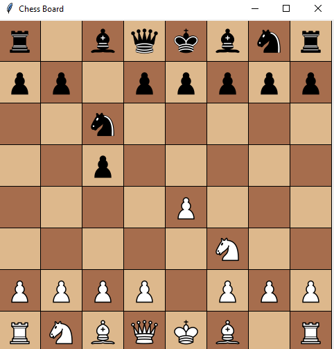

# ChessAI Project

This project is a chess game implemented using Python's `tkinter` library for the graphical user interface and the `python-chess` library for game logic. The game features a chessboard where users can play against an AI powered by Stockfish.

## Features

- Interactive chessboard GUI.
- Drag and drop pieces to make moves.
- AI opponent that uses the Stockfish engine.
- Supports legal moves and basic chess rules.

## Project Structure

```
ChessAI/
├── pieces/              # Folder containing images of chess pieces
│   ├── wp.png          # White pawn
│   ├── wn.png          # White knight
│   ├── wb.png          # White bishop
│   ├── wr.png          # White rook
│   ├── wq.png          # White queen
│   ├── wk.png          # White king
│   ├── bp.png          # Black pawn
│   ├── bn.png          # Black knight
│   ├── bb.png          # Black bishop
│   ├── br.png          # Black rook
│   ├── bq.png          # Black queen
│   └── bk.png          # Black king
├── screenshots/         # Folder containing example game screenshots
│   └── Sicilian_Defense.png  # Example game in Sicilian Defense
└── chess_game.py        # Main Python file for the chess game
```

## Requirements

- Python 3.x
- `tkinter`
- `PIL` (Pillow)
- `python-chess`
- Stockfish engine (download separately and specify path in the code)

## Installation

1. Clone this repository to your local machine:
   ```bash
   git clone https://github.com/yourusername/ChessAI.git
   cd ChessAI
   ```

2. Install required Python packages:
   ```bash
   pip install pillow python-chess
   ```

3. Download the Stockfish engine from the official website https://stockfishchess.org and place it in a suitable directory. Update the path in chess_game.py to point to the Stockfish executable.


## Running the Game

To start the game, run the following command:
```bash
python chess_game.py
```

## Screenshots



## License

This project is open source and available under the [MIT License](LICENSE).

## Acknowledgments

- Thanks to the developers of `python-chess` and Stockfish for their amazing libraries.
